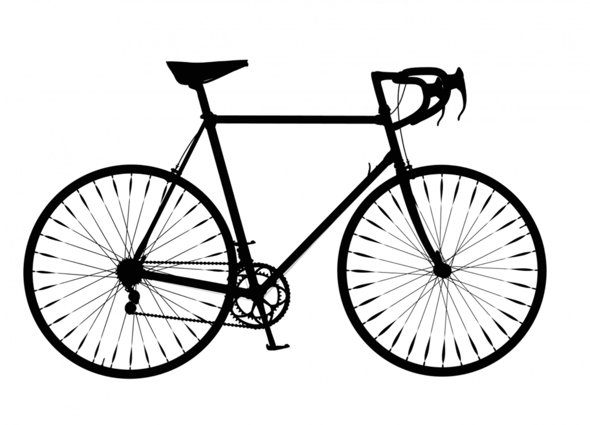
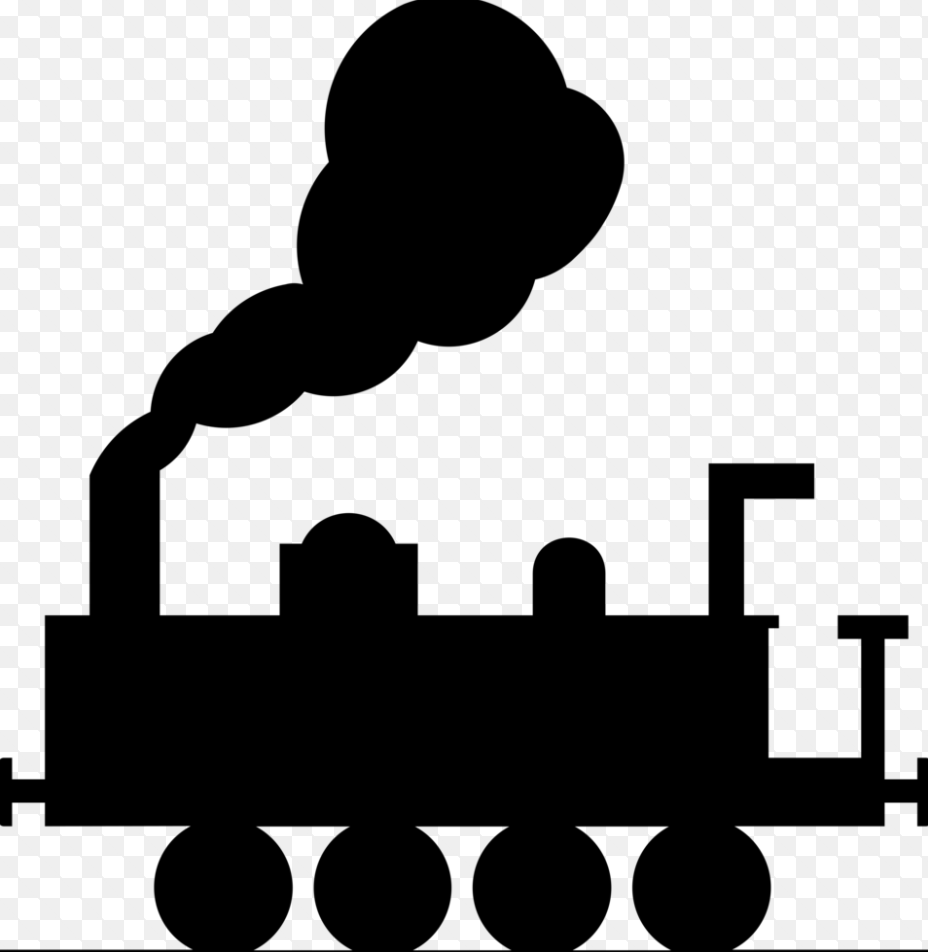

You woke up just on time for school but you have a test first period!
Your school is 30 minutes by bike but your books would slow you down, or you can take the Train but would have transfer, so that also would take about 30 minutes.
What do you want to do? Take the [Bike](Biking.md)  

or
[Train](train.md)  
